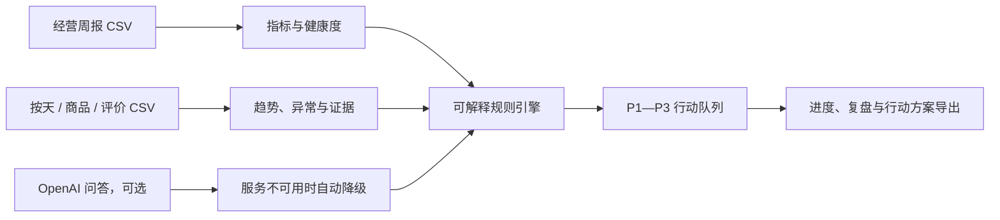

# MerchantMind｜AI 商家增长助手

面向咖啡店等中小商家的经营诊断工具。它把经营数据转成可解释的异常定位、行动建议与复盘目标，帮助商家回答：**这段时间发生了什么、为什么值得关注、下一步做什么。**

## 产品演示流程

1. 在「总览」上传经营周报，查看核心指标、经营提醒与 AI 给出的下一步。
2. 在「经营数据」上传按天经营记录，再切换 7 天、14 天或 1 月趋势；悬停或点击柱状图，可查看当天 GMV、访客、支付订单和支付转化率。
3. 在「AI 诊断」按 P1—P3 查看行动优先级，记录执行进度，并在 7 天后复盘。
4. 在「商品分析」上传商品明细，定位增长机会与体验风险。

## 90 秒演示脚本

1. 打开「总览」，说明健康度会随经营周报中的转化、复购和评分动态变化；点击趋势柱状图，展示每天的 GMV、访客、订单与转化率。
2. 进入「经营数据」，切换近 7 天、近 14 天与近 1 月，展示当前周期和上一周期的 GMV、转化、订单、等待时间对比。
3. 进入「AI 诊断」，展示系统将结论按 P1—P3 排序；勾选一项行动、保存复盘，再复制或导出行动方案。
4. 上传顾客评价或商品明细案例，说明系统会将案例数据替换为当前商家的数据，并将低分评价、缺货、复购等证据接入诊断。

## 架构一览



## 已实现能力

- 上传经营周报 CSV，动态刷新 GMV、支付转化率、复购率和外卖好评率；百分比字段兼容 `0.226` 与 `22.6%` 两种写法。
- 由支付转化率、复购率和外卖好评率实时计算经营健康度，避免展示固定分数。
- 上传按天经营 CSV 后，使用商家自己的记录计算趋势、环比、支付效率和等待时间变化；未上传时使用演示数据。
- 支持近 7 天、近 14 天、近 1 月的可切换分析范围；历史数据不足时明确提示，不展示虚假结果。
- 基于可解释规则定位异常日期，并展示等待时间与支付转化的对比证据。
- 展开查看低分评价样本：日期、渠道、商品、评分、问题标签与顾客反馈。
- 上传顾客评价 CSV 后，自动重新统计低分评价、集中问题与评价样本；未上传时明确标注为演示案例。
- 生成优先动作，支持本机保存执行进度和复盘记录。
- 一键导出包含 P1—P3、核心指标与复盘目标的 Markdown 经营行动方案。
- 上传商品明细 CSV，按销量、收入、毛利、复购、评分和缺货次数识别商品机会，并支持按风险/机会筛选。
- 可选调用 OpenAI API 生成经营问答；服务不可用或额度不足时自动降级为规则版分析。

## 数据与边界

当前演示数据覆盖 28 天经营记录、商品明细与顾客评价。因此近 6 个月和近 1 年入口会提示需要更多历史数据，而不是伪造分析结论。

第一版尚未接入外卖平台、支付系统或真实商家账号。上传的经营周报、按天经营记录、顾客评价和商品明细会保存在当前设备的浏览器中，可随时恢复演示数据；它们不会上传到服务器。

当前经营周报只包含 4 项汇总指标，因此它可以驱动总览和行动优先级，但不能严谨定位某一天或某个高峰时段的问题。上传按天经营记录后，趋势、异常日期和周期对比会使用该文件；评价证据仍需单独接入，系统不会把案例评价当作用户的真实数据。

## 技术实现

- React + TypeScript
- Next.js / Vinext
- CSV 文件解析与客户端数据状态管理
- OpenAI Responses API（服务端 API 路由）
- 可解释的经营规则与容错降级策略
- Open Graph / X 分享元信息与品牌预览图
- Vitest 核心规则测试；通过 AI coding assistant 协作完成需求拆分、界面迭代、代码验证与发布检查

## 质量检查

- 使用 Vitest 为 CSV 引号解析、百分比字段兼容和经营健康度评分建立自动化测试。
- 每次发布前执行 `npm test`、`npm run build` 与 `npm run lint`。

## 关键设计取舍

- **可解释优先：** 核心优先级由经营规则生成，避免只给出无法验证的大模型结论。
- **数据边界明确：** 经营汇总、按天记录与商品明细分开上传；趋势和异常定位优先使用商家自己的按天数据，不把案例评价当作真实商家结论。
- **服务可用性优先：** OpenAI 服务不可用或额度不足时，自动降级为规则版回答，核心诊断流程仍可完成。
- **演示数据与隐私：** 上传文件只保存在当前浏览器；第一版不接入真实外卖平台、支付系统或商家账号。

## 本地运行

```bash
npm install
npm run dev
```

打开终端显示的本地地址即可体验。

## 可以这样介绍项目

> 我独立设计并实现了 MerchantMind，一款面向中小商家的 AI 经营诊断工具。我将经营周报、按天经营数据、商品明细和顾客评价组织成可解释的数据分析流程：先做多周期趋势和异常定位，再以评价证据解释问题，最后生成可执行行动并支持复盘。系统会区分用户上传汇总与项目案例证据，避免混用数据；大模型不可用时，仍可用规则引擎输出基于数据的建议。
